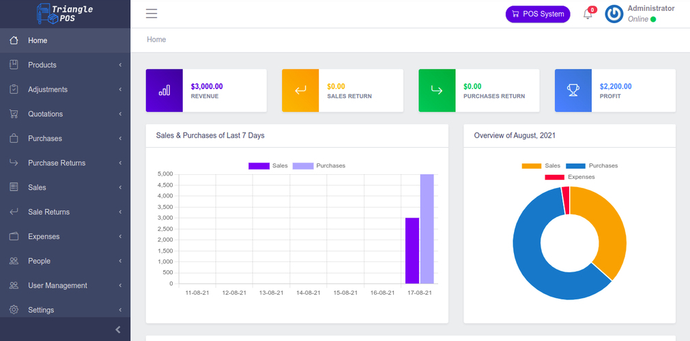

<picture>
    <source srcset="public/images/logo.png"  
            media="(prefers-color-scheme: dark)">
    
</picture>

> **Important Note:** This Project is ready for Production. But use code from main branch only. If you find any bug or have any suggestion please create an Issue.

# Local Installation

- run `` git clone https://github.com/aulaleslie/tiga-saudara-ERP.git ``
- run ``composer install `` 
- run `` npm install ``
- run ``npm run dev``
- copy .env.example to .env
- run `` php artisan key:generate ``
- set up your database in the .env
- run `` php artisan migrate --seed ``
- run `` php artisan storage:link ``
- run `` php artisan serve ``
- then visit `` http://localhost:8000 or http://127.0.0.1:8000 ``.

### Browser Extension Console Noise (Local Dev)

If your browser console shows intermittent `sw.js`, `runtime.lastError`, `mobx-state-tree`, or `lockdown-install.js` warnings during local development, follow this runbook first:

- [`docs/troubleshooting/browser-extension-console-noise.md`](docs/troubleshooting/browser-extension-console-noise.md)

# Admin Credentials
> Email: super.admin@test.com || Password: 12345678

## Demo

**Live Demo:** will update soon

## Tiga Saudara ERP Features

- **Products Management & Barcode Printing**
- **Stock Management**
- **Make Quotation & Send Via Email**
- **Purchase Management**
- **Sale Management**
- **Purchase & Sale Return Management**
- **Expense Management**
- **Customer & Supplier Management**
- **Pengaturan Pengguna (Peran & Izin)**
- **Product Multiple Images**
- **Multiple Currency Settings**
- **Unit Settings**
- **System Settings**
- **Reports**

### PDF Configuration for Windows

> **Important Note:** "Tiga Saudara ERP" now uses the vendor-provided wkhtmltopdf binaries by default—no `.env` override is required.

- **Linux:** bundled via `h4cc/wkhtmltopdf-amd64` and used from `vendor/bin/wkhtmltopdf-amd64`.
- **Windows:** install the Windows binary package with Composer so the vendor path is available:
  ```bash
  composer require wemersonjanuario/wkhtmltopdf-windows:^0.12
  ```
- **Config cache:** if you change packages, clear config to pick up the new binary location:
  ```bash
  php artisan config:clear
  ```

# License
**[Creative Commons Attribution 4.0	cc-by-4.0](https://creativecommons.org/licenses/by/4.0/)**

## Maintenance Commands

```bash
php artisan queue:work --queue=default --tries=3 --timeout=7200
php artisan product:normalize-purchase-prices
php artisan product:normalize-purchase-prices --write

# Initialization only: rebuild imported purchase/sales transaction history.
# Dry-run first, then run with both flags when ready. The write command truncates transactions.
php artisan inventory:normalize-import-transactions
php artisan inventory:normalize-import-transactions --initialize --write

# Backfill historical sale detail cost snapshots for Laporan Laba Rugi.
# Run dry-run first, inspect warning counts, then run with --write.
php artisan sales:backfill-cost-snapshots
php artisan sales:backfill-cost-snapshots --write

# Recompute existing backfilled snapshots when historical purchase/receiving data changed.
php artisan sales:backfill-cost-snapshots --write --force

# Optional filters for smaller/manual runs.
php artisan sales:backfill-cost-snapshots --product=123
php artisan sales:backfill-cost-snapshots --setting=1 --start=2026-01-01 --end=2026-06-30
php artisan sales:backfill-cost-snapshots --write --setting=1 --start=2026-01-01 --end=2026-06-30

# Repair and sync persisted notification rows for stock, approval, and revision states.
php artisan notifications:sync

# Manually prune old notifications. Notifications are retained unless this command is run.
php artisan notifications:prune --days=30

# Export product barcodes. The default output is storage/app/product_barcodes_export.csv.
php artisan product:export-barcodes

# Export to a specific CSV file and overwrite it without confirmation.
php artisan product:export-barcodes --path=/path/to/barcodes.csv --force

# Import requires the CSV path. Run a dry-run before applying changes.
php artisan product:import-barcodes storage/app/product_barcodes_export.csv --dry-run
php artisan product:import-barcodes storage/app/product_barcodes_export.csv
```

### Barcode Import and Export

Barcode CSV files must contain `product_name,barcode`. Import matches an exact product name and skips missing or ambiguous products, products that already have a barcode, invalid barcodes, and barcodes already in use.

### Sales Cost Snapshot Backfill

`sales:backfill-cost-snapshots` normalizes historical sale detail cost snapshots used by Laporan Laba Rugi. The command replays product purchases, approved receiving notes, purchase returns, and sales by effective date so profit/loss uses `sales - sales cost - expenses` instead of current mutable product average prices.

- Dry-run is the default and does not write changes.
- `--write` persists calculated `cost_unit_snapshot`, `cost_total_snapshot`, `cost_snapshot_source`, and `cost_snapshot_at` on `sale_details`.
- `--force` recomputes existing backfilled snapshots; use it after correcting historical purchase or receiving data.
- `--product`, `--setting`, `--start`, and `--end` can limit the replay scope for manual checks.
- Review summary warnings before writing, especially `negative_stock`, `missing_receipt_data`, `future_purchase_fallback`, `no_purchase_fallback`, and `non_stock_zero`.

### Import Transaction Normalization

`inventory:normalize-import-transactions` is an initialization-only command for rebuilding the stock transaction ledger from imported purchase and sales documents.

- Dry-run is the default and does not write changes.
- `--initialize --write` truncates `transactions` and recreates normalized import movements.
- Imported purchases create `BUY` transactions with positive quantities.
- Imported sales create `SELL` transactions with negative quantities.
- The command does not update `product_stocks`; product stock snapshot import remains the only import path that hardens current stock quantities.
- Run this before product stock snapshot import. Stock snapshot import then updates `product_stocks` and creates `ADJ` transactions from the latest normalized ledger balance to the snapshot quantity.

Recommended initialization order:

```bash
# 1. Import purchase and sales documents through the import screens.

# 2. Rebuild historical BUY/SELL transaction ledger.
php artisan inventory:normalize-import-transactions
php artisan inventory:normalize-import-transactions --initialize --write

# 3. Import product stock snapshot through the product stock import screen.
```
