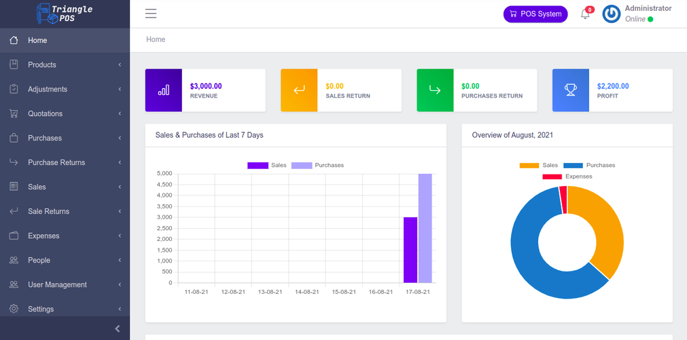

<picture>
    <source srcset="public/images/logo.png"  
            media="(prefers-color-scheme: dark)">
    
</picture>

> **Important Note:** This Project is ready for Production. But use code from main branch only. If you find any bug or have any suggestion please create an Issue.

# Local Installation

- run `` git clone https://github.com/aulaleslie/tiga-saudara-ERP.git ``
- run ``composer install `` 
- run `` npm install ``
- run ``npm run dev``
- copy .env.example to .env
- run `` php artisan key:generate ``
- set up your database in the .env
- run `` php artisan migrate --seed ``
- run `` php artisan storage:link ``
- run `` php artisan serve ``
- then visit `` http://localhost:8000 or http://127.0.0.1:8000 ``.

# Admin Credentials
> Email: super.admin@test.com || Password: 12345678

## Demo

**Live Demo:** will update soon

## Tiga Saudara ERP Features

- **Products Management & Barcode Printing**
- **Stock Management**
- **Make Quotation & Send Via Email**
- **Purchase Management**
- **Sale Management**
- **Purchase & Sale Return Management**
- **Expense Management**
- **Customer & Supplier Management**
- **Pengaturan Pengguna (Peran & Izin)**
- **Product Multiple Images**
- **Multiple Currency Settings**
- **Unit Settings**
- **System Settings**
- **Reports**

### PDF Configuration for Windows

> **Important Note:** "Tiga Saudara ERP" now uses the vendor-provided wkhtmltopdf binaries by default—no `.env` override is required.

- **Linux:** bundled via `h4cc/wkhtmltopdf-amd64` and used from `vendor/bin/wkhtmltopdf-amd64`.
- **Windows:** install the Windows binary package with Composer so the vendor path is available:
  ```bash
  composer require wemersonjanuario/wkhtmltopdf-windows:^0.12
  ```
- **Config cache:** if you change packages, clear config to pick up the new binary location:
  ```bash
  php artisan config:clear
  ```

# License
**[Creative Commons Attribution 4.0	cc-by-4.0](https://creativecommons.org/licenses/by/4.0/)**
